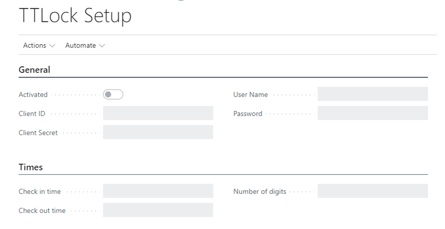
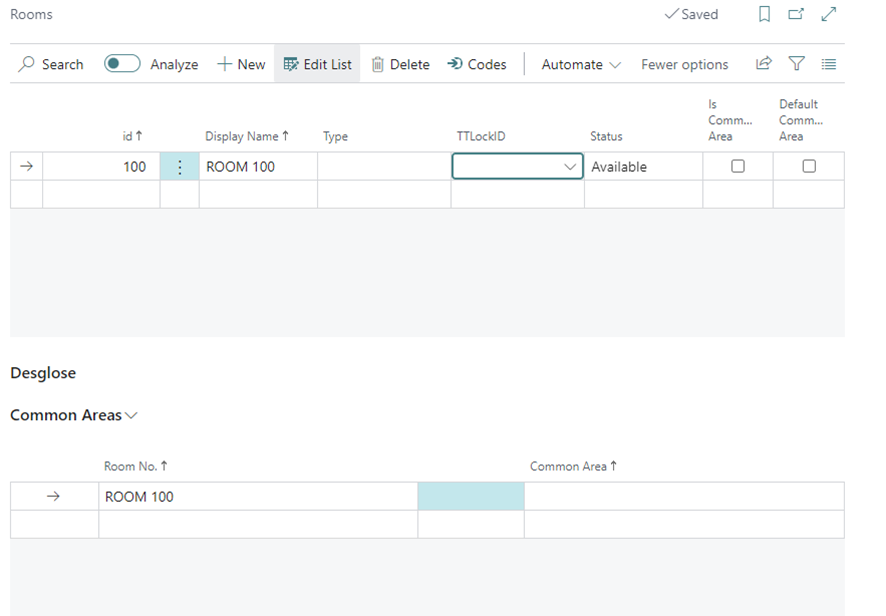
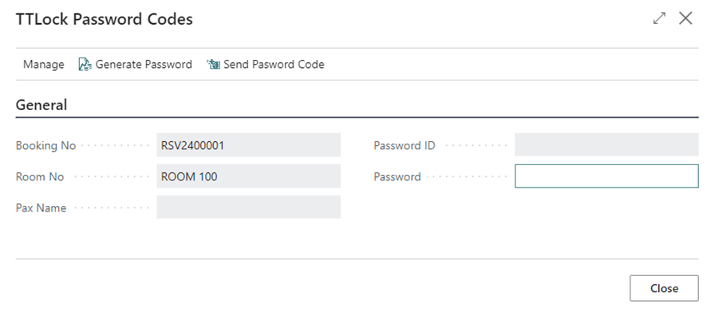

1.  **Configuración**

Para configurar las cerraduras de TTLock necesitamos ir a la página
“TTLock Setup” y activar.

Para la activación nos solicitará un Client ID y Client Secret
suministrados por SUITECH.

El “user name” y “password” serán los suministrados por la aplicación.

En la configuración de “Times”, encontraremos el Check-In Time y
Check-out Time por defecto, así como el número de dígitos que generara
la clave.

Una vez configurado, la app estará activada para leer las cerraduras.

2.  **Listado de cerraduras**

> La lista de cerraduras, mostrará la lista de cerraduras disponible:
>
> 

3.  **Asignación de cerraduras a las habitaciones**

Permite asignar un número de cerradura a cada habitación.

4.  **Asignar una contraseña a una cerradura**

Permite asignar una contraseña a una habitación en función de la
cerradura seleccionada.

